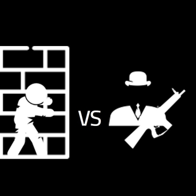

# The Undressed Hero

Inviseeble felt like doing something bad one day. He went invisible and then realised he doesn't seem to find his weapon. While waiting for his power to recharge, HitAll recieved a call: Inviseeble was going to rob a bank. Our hero managed to leave his house without losing his clothes but when trying to enter villain's hub, luck went missing. After hitting the walls for a few times, the hero got inside, but without clothes. Miraculously, his clothes ended on Inviseeble. This way, HitAll could see where the villain was and could fight him.

## Characters

- [Inviseeble](./../Cast/Villains/Inviseeble.md)
- [HitAll](./../Cast/Heroes/HitAll.md)
